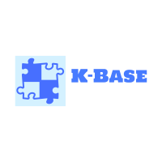
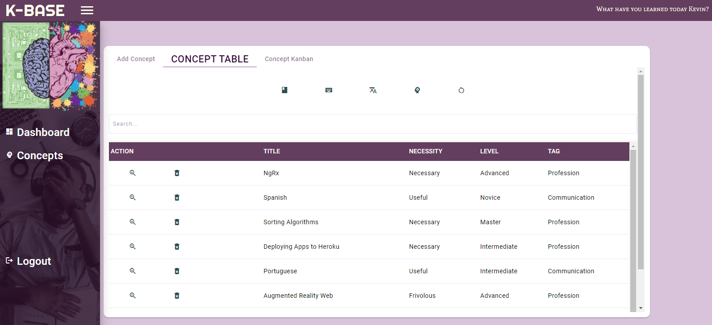

<!-- PROJECT LOGO -->
<br />
<p align="center">
  <a href="">
    
  </a>

  <h3 align="center">K-Base</h3>

  <p align="center">
   A Personal Knowledge Base System (This is the frontend for this project)
    <br />
    <a href="https://github.com/kevinmilly/K-Base-frontend"><strong>Explore the docs »</strong></a>
    <br />
    <br />
    <a href="#demo">View Demo</a>
    .
    <a href="https://github.com/kevinmilly/K-Base-frontend/issues">Report Bug</a>
    .
    <a href="https://github.com/kevinmilly/K-Base-frontend/issues">Request Feature</a>
  </p>
</p>


<!-- TABLE OF CONTENTS -->
<details open="open">
  <summary>Table of Contents</summary>
  <ol>
    <li>
      <a href="#about-the-project">About The Project</a>
      <ul>
        <li><a href="#built-with">Built With</a></li>
      </ul>
    </li>
    <li>
      <a href="#getting-started">Getting Started</a>
      <ul>
        <li><a href="#prerequisites">Prerequisites</a></li>
        <li><a href="#generaluse">End User Setup</a></li>
        <li><a href="#installation">Developer Setup</a></li>
      </ul>
    </li>
    <li><a href="#roadmap">Roadmap</a></li>
    <li><a href="#contributing">Contributing</a></li>
    <li><a href="#license">License</a></li>
    <li><a href="#contact">Contact</a></li>

  </ol>
</details>


<!-- ABOUT THE PROJECT -->
## About The Project



Hello Friends and future prospective contributors!  I'm passionate about learning new things and remembering them.  Thus I wanted to make a tool that would help a user
step through the process of learning concepts.  When you think about it usually those steps go like this:

* Idea: You come up with an idea of what you would like to learn.  During this stage you could say you have "Conscious Incompetence".
* Curation: You look for resources to help you learn more.  In my experience, initially, this process is indiscriminate; you take in a variety of sources.  However, eventually you have to sort through your sources to find true resouces you can use to learn the concept.
* Studying/Learning: We learn so quickly from data as we parse it, that this step flows quickly from the previous one.  I think during this step you are not only learning and growing towards "Conscious Compentence" but you are also continuing to audit your resources, filtering out ones that are useless or irrelevant to you at the moment.  Also, learning involves testing our recollection of a concept through subsequent note-taking after a viewing or reading session.  The notes can help us with the short term recording of thoughts and lessons learned.  They can also serve as an anchor for later spaced repetition.
* Advanced Studying: I think moving into more "Unconscious Competence" involves lodging the concepts into your long-term memory.  Regular and strategically placed intervals of study can help with this.  Also, depending on the concept, you can usually find ways to apply what you learned (building an app to test your coding skills, visiting a country to test your language learning, etc.)

This project aims to facilitate the aforementioned process:

* Idea: Record your ideas with the 'Add A Concept Feature'.  From your viewpoint, choose how difficult the subject is; is it an advanced concept?  Also, choose the priority of learning this concept; is it something you have to know or just fun trivia?
* Curation: Currently through the kanban view you, you can drill into a concept by clicking on the "Resources" link.  The resulting modal that pops up will curate sources from Google that may be a helpful resource for learning the concept.  If you would like to look more into a particular result you can drag it into the resource column and save it for the concept.  
* Studying/Learning: This step largely happens outside of the app; using the resources you curated for the concept (or outside resources you can later associate to the concept).  After a learning session, within the app, you can take notes summarizing or detailing what you have learned.  You can categorize the type of note you are taking (random thought, crucial info etc.), helpful for future sorting.
* Advanced Studying: You can track your progress through moving the concept through stages of your competency, as you view it of course.  The sources from Google are tailored  based on what column/stage the concept is at.  For instance, if a concept is in the most advanced stage '1%' then you see sources that focus on applying the knowledge or teaching it to others at an expert level or gaining more information that's 'advanced'.

All in all, there's more work to be done on fleshing this out and of course making the UI and UX more favorable to users.


## Demo


## Built With

* [MongoDB](https://www.mongodb.com/)
* [Express](https://expressjs.com/)
* [Angular](https://angular.io/)
* [NodeJS](https://nodejs.org/en/)


### Getting Started

Depending how you want to get involved, below are some steps if you want to help with development or use learn more effectively.

### End User Setup

COMING SOON - Working on deploying to different host environment

### Developer Setup

1. Clone the repo
   ```sh
   git clone https://github.com/kevinmilly/Queue-D.git
   ```
2. Install NPM packages
   ```sh
   npm install
   ```
## Roadmap

*General UX is an ongoing project.


See the [open issues](https://github.com/kevinmilly/QueueD/issues) for a list of proposed features (and known issues).

<!-- CONTRIBUTING -->
## Contributing

Contributions are what make the open source community such an amazing place to be learn, inspire, and create. Any contributions you make are **greatly appreciated**.


1. Fork the Project
2. Create your Feature Branch (`git checkout -b feature/AmazingFeature`)
3. Commit your Changes (`git commit -m 'Add some AmazingFeature'`)
4. Push to the Branch (`git push origin feature/AmazingFeature`)
5. Open a Pull Request


<!-- LICENSE -->
## License

Distributed under the MIT License. See `LICENSE` for more information.


<!-- CONTACT -->
## Contact

Kevin Smith - [Connect with me on LinkedIn](https://www.linkedin.com/in/ksmithtech/) - https://www.linkedin.com/in/ksmithtech/

Email me at: kevinmilly@gmail.com
